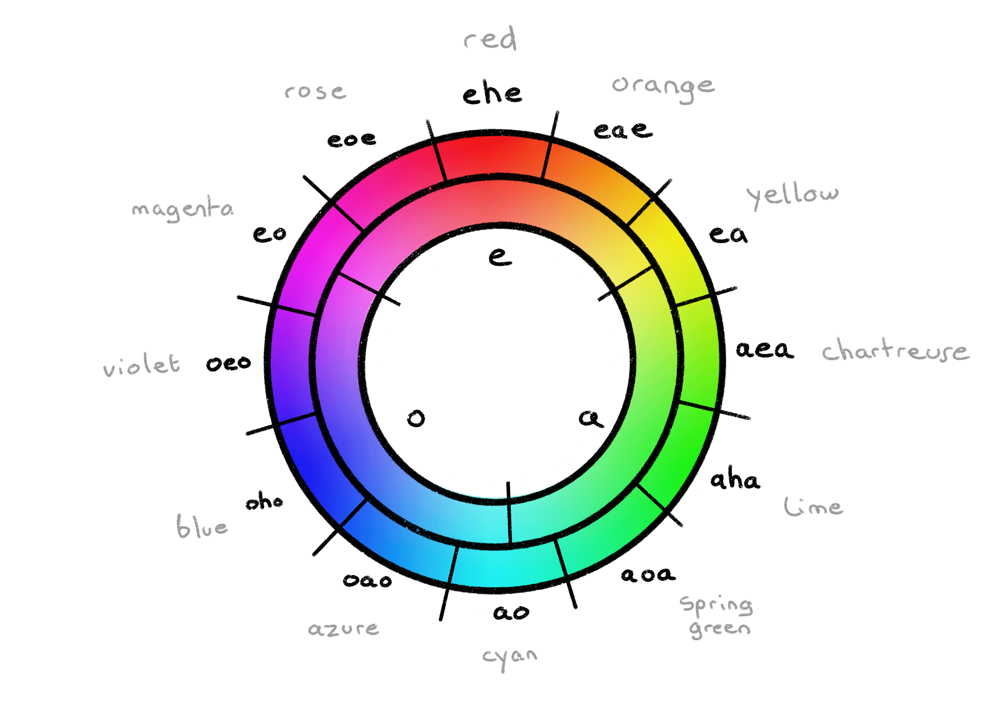

# Colors

__zino__ is used to speak about the color __A__ of thing __E__, perceived by __O__ (which defaults
to the opiner/bzael). It purposefully speaks about the perception of color and not "the real color
of the object". For exemple if a white object is only lit with a red light, it will be perceived red
by the observer (unless they are color blind).

The words for the colors themselves follow the pattern zmXr and are based on the [HSV coordinate
system]. Colors represent a main coordinate and a range of close coordinates that are considered to
be similar enough (TODO: specify such acceptable range).

[HSV coordinate system]: https://en.wikipedia.org/wiki/HSL_and_HSV

- zmir: E is color white
- zmer: E is color red-ish
- zmar: E is color green-ish
- zmor: E is color blue-ish
- zmur: E is color black

Words for red/green/blue above are very broad if proper hue precision is unnecessary, but more
precise colors can be expressed by following the same pattern while combining the vowels :

__zmire__ and __zmure__ allows to speak about ligher (less saturated) and darker (less value)
colors.