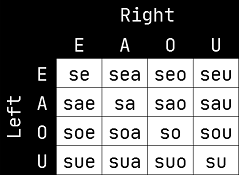

# Explicit switches

## SE prefix

As said in the previous chapter, predicates can have more places than just
__E__ and __A__, such as __van__ :

- __van__: `(Ed) goes to [Ad] from (Od).`
- spur : `(Ed) is a nest/house/home for [Ad].`
- peol: `(Ed) is a town/city.`

``gloss
mi van spur mo

mi van spur mo

{\[E:$(b) is me\]} {\[E:$(b) goes to A:$(c) from O:$(c)\]}
{\[E:$(c) is a house for A:$(f)\]} {\[E:$(f) is you\]}

I go to a house of yours.
``

We can prefix a predicate by particle of family __SE__ (composed of all
particles starting with __s__) to choose explictely which places will be the
__left__ and __right__ places when chained.

``gloss
mi seo van spur mo

mi __seo__ van spur mo

{\[E:$(b) is me\]} {__\<EO\>__}
{\[__E:$(b)__ goes to A:$(c) from __O:$(d)__\]}
{\[E:$(d) is a house for A:$(f)\]} {\[E:$(f) is you\] 〉}

I go from a house of yours.
``

> Non __switch predicates__ thus behave like if they were prefixed by __se__,
> while __switch predicates__ behave life if they were prefixed by __sea__.

## VE/FE suffix

However, simply chaining predicate words one after the other, with or without
__SE__, will not allow to use more than 2 places. will not allow to switch
to the __O__ place _individual variable_.

Another way to explicitly switch is to use families __VE__, __VEI__ and __FE__.

The __VE__ particle family contains all particles starting with __v__, except
__vei__ which is the only member of family __VEI__. All particles of the __FE__
family starts with __f__.

__VE__ can be used __after__ a predicate word to choose which place to switch
to, and also start what is called a __VE-scope__, which we'll write using
angle brackets `〈 〉` in the glosses.

__ve__ switches to the __E__ place, __va__ to the __A__ place, __vo__ to the
__O__ place and finally __vu__ to the __U__ place.

``gloss
mi van vo spur mo

mi van __vo__ spur mo

{\[E:$(b) is me\]} {\[E:$(d) goes to A:$(c) from __O:$(d)__\]}
{〈 switch to __O:$(d)__} {\[E:$(d) is a house for A:$(f)\]}
{\[E:$(f) is you\] 〉}

I go from a house of yours.
``

However, __VE__ alone is not enough to switch later to another place of _van_,
as using another __VE__ would switch to a place of the predicate immediatly
before it instead. __FE__, on the other hand, will switch to a place of the
_same predicate as the __VE__ starting the current __VE-scope___. Members of
__FE__ are the same as the members of __VE__ but with the __v__ replaced by
__f__.

``gloss
mi van vo spur mo fa peol

mi van __vo__ spur mo __fa__ peol

{\[E:$(b) is me\]} {\[E:$(b) goes to __A:$(c)__ from O:$(d)\]} 
{〈 switch to O:$(d)} {\[E:$(d) is a house for A:$(f)\]}
{\[E:$(f) is you\]} {switch to __A:$(c)__} {\[E:$(c) is a town\] 〉}

I go from a house of yours to the town.
``

The order of the explicit switches are irrelevant :

``gloss
mi van va peol fo spur mo 

mi van __va__ peol __fo__ spur mo

{\[E:$(b) is me\]} {\[E:$(b) goes to A:$(c) from O:$(d)\]}
{〈 switch to A:$(c)} {\[E:$(c) is a town\]}
{switch to O:$(d)} {\[E:$(d) is a house for A:$(f)\]}
{\[E:$(f) is you\] 〉}

I go to the town from a house of yours.
``

Finally, __VEI__ allows to explicitly close the current __VE-scope__, switching
back to the normal place __individual variable__ explained in the previous
chapter or defined by __SE__.

``gloss
mi van vo spur mo vei peol

mi van __vo__ spur mo __vei__ peol

{\[E:$(b) is me\]} {\[E:$(b) goes to __A:$(c)__ from O:$(d)\]}
{〈 switch to O:$(d)} {\[E:$(d) is a house for A:$(f)\]} {\[E:$(f) is you\]} 〉
{\[__E:$(c)__ is a town\]}

I go from a house of yours to the town.
``

While in simple sentences like this one it is equivalent to using the proper
__FE__, __VEI__ can be necessary when dealing with multiple nested
__VE-scopes__.

> Nested __VE-scopes__ can become a bit overwelming if they are too long or to
> many. We'll see in a subsequent chapter how to avoid them and keep sentences
> simple.